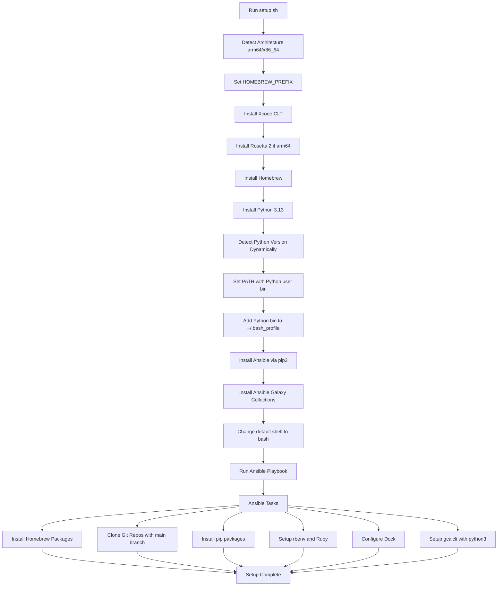

# my-osx-setup

One-command automated macOS laptop provisioning using shell scripts and Ansible.

**✅ Apple Silicon (M1/M2/M3/M4) Compatible**  
**✅ Intel Compatible**  
**✅ macOS 13+ (Ventura, Sonoma, Sequoia) Compatible**

## Overview

This repository provides a complete, end-to-end setup script for provisioning a brand-new macOS laptop. It automatically detects your architecture (Apple Silicon vs Intel) and configures everything appropriately.

**This is NOT a minimal bootstrap** — it's a complete machine setup in one command.

## Quick Start

### One-Command Installation (No SSH Key Needed!)

```bash
# Option 1: Bootstrap script (fully automated)
curl -fsSL https://raw.githubusercontent.com/washingtoneg/my-osx-setup/main/bootstrap.sh | bash

# Option 2: Clone with HTTPS and run manually
git clone https://github.com/washingtoneg/my-osx-setup.git
cd my-osx-setup
./setup.sh
```

**No SSH keys required for initial setup!** The script uses HTTPS to clone the repository.

## What Gets Installed

This script provisions:

- ✅ **Xcode Command Line Tools**: Required for development
- ✅ **Rosetta 2** (Apple Silicon only): For Intel compatibility
- ✅ **Homebrew**: At the correct path (`/opt/homebrew` for Apple Silicon, `/usr/local` for Intel)
- ✅ **Python 3.12**: Required for Ansible and development
- ✅ **Ansible**: Configuration management tool with required collections
- ✅ **Development Tools**: Git, build tools, language runtimes (via Homebrew)
- ✅ **Applications**: Docker, iTerm2, Slack, Spotify, etc. (via Homebrew casks)
- ✅ **macOS Preferences**: System settings and customizations
- ✅ **Ruby Environment**: rbenv and Ruby 3.2.2
- ✅ **Python Packages**: awscli, gcalcli, virtualenvwrapper, etc.

## System Requirements

- **macOS Version**: macOS 13 (Ventura) or later
- **Architecture**: Apple Silicon (M1/M2/M3/M4) or Intel
- **Network**: Active internet connection
- **User Account**: Administrator privileges (sudo)
- **Time**: 30-60 minutes for complete setup

## Repository Structure

```
my-osx-setup/
├── setup.sh              # Main entry point - orchestrates entire setup
├── bootstrap.sh          # Optional bootstrap for first-time use
├── bash_utils.sh         # Shell utility functions
├── ansible.cfg           # Root Ansible configuration
└── ansible/              # Ansible playbooks, roles, and tasks
    ├── ansible.cfg       # Ansible working configuration
    ├── hosts             # Dynamic inventory (architecture-aware)
    ├── requirements.yml  # Ansible Galaxy collections
    ├── playbooks/
    │   └── darwin_bootstrap.yml
    └── roles/
        └── darwin_bootstrap/
            ├── defaults/main.yml    # Package lists and settings
            ├── tasks/
            │   ├── main.yml
            │   ├── homebrew.yml     # Homebrew setup
            │   ├── git.yml          # Git configuration
            │   ├── ssh_config.yml   # SSH setup
            │   └── ...
            └── handlers/main.yml
```

## How It Works



### Step-by-Step Process

1. **Detect architecture** (Apple Silicon vs Intel)
2. **Set Homebrew prefix** (`/opt/homebrew` or `/usr/local`)
3. **Install Xcode Command Line Tools**
4. **Install Rosetta 2** (Apple Silicon only)
5. **Install Homebrew**
6. **Install Python 3.13**
7. **Dynamically detect Python version** and update PATH
8. **Add Python user bin to ~/.bash_profile** for persistence
9. **Install Ansible** via pip3
10. **Install Ansible Galaxy collections**
11. **Change default shell to bash** (if currently zsh)
12. **Run Ansible playbook** which provisions:
    - Homebrew taps, casks, and packages
    - Python packages via pip
    - Ruby gems via rbenv
    - Git repositories
    - SSH configuration
    - macOS system preferences
    - Docker configuration
    - Dock customization

## Interactive Steps

**This script IS interactive** and will:

- ✅ Prompt for sudo password (multiple times)
- ✅ Wait for Xcode CLT installation to complete
- ✅ Wait for Ansible to complete
- ✅ Request your GitHub API token (required for SSH key setup)

**Do not run this unattended** — it requires user interaction.

## Prerequisites

### Before Running

1. **Fresh macOS installation** (recommended) or backup your data
2. **Connect to power** (installation takes 30-60 minutes)
3. **Stable internet connection**
4. **GitHub Personal Access Token** with `admin:public_key` scope
   - Create at: https://github.com/settings/tokens/new
   - Export in your shell: `export GITHUB_API_TOKEN="your_token_here"`

### Architecture Support

The script **automatically detects** your architecture:

- **Apple Silicon (arm64)**: Uses `/opt/homebrew` and installs Rosetta 2
- **Intel (x86_64)**: Uses `/usr/local`

No manual configuration needed!

## Customization

### Modifying Installed Packages

Edit `ansible/roles/darwin_bootstrap/defaults/main.yml`:

```yaml
homebrew_packages:
  - git
  - wget
  # Add your packages here

homebrew_casks:
  - google-chrome
  - visual-studio-code
  # Add your apps here
```

### Adding Custom Tasks

Create new task files in `ansible/roles/darwin_bootstrap/tasks/` and include them in `main.yml`.

## Dotfiles

**Dotfiles are explicitly out of scope** for this repository.

After running this setup, clone your dotfiles separately:

```bash
cd ~/scratch
git clone https://github.com/washingtoneg/dotfiles.git
cd dotfiles
./install.sh  # or whatever your dotfiles repo uses
```

## SSH Key Setup

After setup completes:

### 1. Generate SSH Key

```bash
ssh-keygen -t ed25519 -C "your_email@example.com"
# Press Enter to accept default location
# Enter a passphrase (recommended)
```

### 2. Add to GitHub

```bash
cat ~/.ssh/id_ed25519.pub | pbcopy
```

Then paste at: https://github.com/settings/ssh/new

### 3. Test Connection

```bash
ssh -T git@github.com
# Should see: "Hi username! You've successfully authenticated..."
```

## Troubleshooting

### "Command Line Tools not found"

```bash
# Manual installation
xcode-select --install

# Wait for GUI installer to complete, then re-run setup
./setup.sh
```

### "Homebrew not found" or "brew: command not found"

```bash
# Add Homebrew to PATH
eval "$(/opt/homebrew/bin/brew shellenv)"  # Apple Silicon
eval "$(/usr/local/bin/brew shellenv)"     # Intel

# Add to shell profile
echo 'eval "$(/opt/homebrew/bin/brew shellenv)"' >> ~/.zshrc
```

### "Ansible module not found"

```bash
# Install Ansible collections
cd ansible
ansible-galaxy collection install -r requirements.yml
```

### "Permission Denied" Errors

Some operations require Full Disk Access:

1. System Settings > Privacy & Security > Full Disk Access
2. Add Terminal.app (or iTerm.app)
3. Restart terminal and re-run setup

### "GITHUB_API_TOKEN is required"

```bash
# Create token at: https://github.com/settings/tokens/new
# Scope: admin:public_key
export GITHUB_API_TOKEN="your_token_here"
./setup.sh
```

## What Changed in 2026 Update

This repository was updated for Apple Silicon and modern macOS:

### Critical Fixes
- ✅ Architecture detection (Apple Silicon vs Intel)
- ✅ Homebrew path handling (`/opt/homebrew` vs `/usr/local`)
- ✅ Updated Homebrew install URL (HEAD instead of legacy branch name)
- ✅ Python 3.12 instead of Python 2 (EOL)
- ✅ Ansible installed via pip3 (not Homebrew)
- ✅ Ansible collections support (community.general)
- ✅ Ansible module FQCN (Fully Qualified Collection Names)
- ✅ Rosetta 2 installation on Apple Silicon
- ✅ Improved Xcode CLT detection

### Package Updates
- ✅ `python@2` → `python@3.12`
- ✅ `postgresql@9.6` → `postgresql@16`
- ✅ Ruby 2.6.1 → Ruby 3.2.2

## Testing Checklist

After running setup:

```bash
# Verify Homebrew
brew --version
brew --prefix  # /opt/homebrew or /usr/local

# Verify Python
python3 --version

# Verify Ansible
ansible --version
ansible-galaxy collection list | grep community.general

# Verify architecture detection
uname -m
```

## Compatibility

### ✅ Tested On
- macOS 15 (Sequoia) - Apple Silicon
- macOS 14 (Sonoma) - Apple Silicon & Intel
- macOS 13 (Ventura) - Apple Silicon & Intel

### ⚠️ May Work On
- macOS 12 (Monterey) with adjustments

### ❌ Will NOT Work On
- macOS 11 (Big Sur) or earlier
- Non-admin users

## Contributing

Contributions welcome! Please:

1. Test on a fresh macOS installation (VM recommended)
2. Ensure changes work on both Apple Silicon and Intel
3. Keep the script idempotent (can run multiple times)
4. Document any new dependencies

## Design Philosophy

1. **One Command**: No multi-step bootstrapping
2. **Ansible-Based**: Declarative, easy to modify
3. **Interactive**: Prompts when needed (more reliable)
4. **Architecture-Aware**: Works on both Apple Silicon and Intel
5. **No Dotfiles**: Keeps personal config separate

## License

MIT License - See LICENSE file for details

## Acknowledgments

Built on the shoulders of giants in the macOS automation community.

## Support

For issues or questions:

1. Check Troubleshooting section above
2. Review closed issues on GitHub
3. Open a new issue with:
   - macOS version (`sw_vers`)
   - Architecture (`uname -m`)
   - Error output
   - What you were trying to accomplish

---

**Remember**: This is a **full machine setup**, not a minimal bootstrap. Review the package lists before running if you want to customize what gets installed.

**Happy Hacking! 🚀**
